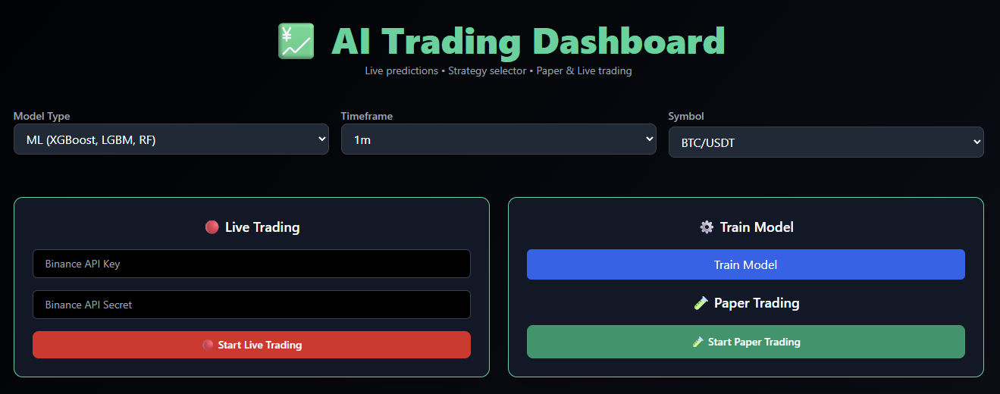
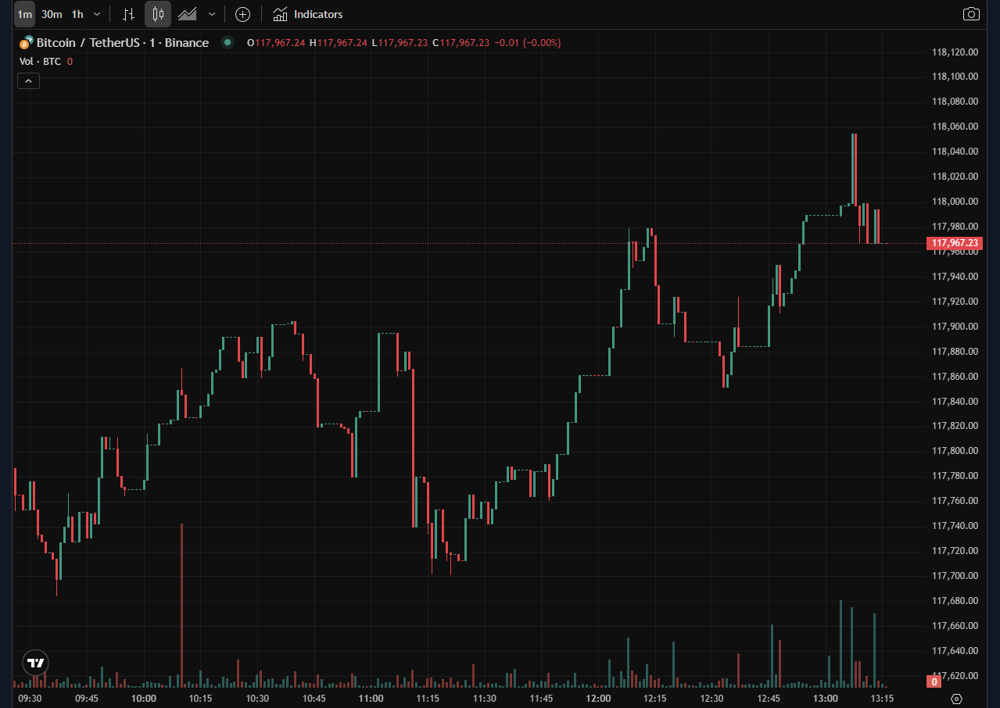
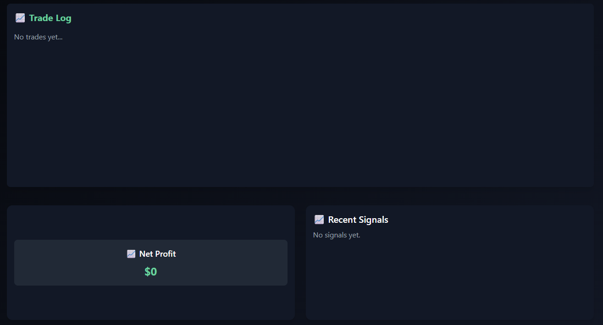

# 🚀 InvestIQ – AI Crypto Paper Trading Platform  
🔗 [Live Site](https://invest-iq-five.vercel.app/)  

[](https://www.python.org/)
[](https://fastapi.tiangolo.com/)
[](https://reactjs.org/)
[](https://tailwindcss.com/)
[](https://github.com/ccxt/ccxt)
[](https://xgboost.readthedocs.io/)
[](https://lightgbm.readthedocs.io/)
[](https://scikit-learn.org/)

---

## 💡 About  
**InvestIQ** is a full-stack machine learning web app for real-time crypto **signal prediction** and **paper trading**. It uses technical indicators + ensemble ML classifiers to decide whether to **BUY** or **SELL**, simulates trades, and tracks PnL. Built for both web and mobile.

---

## 🧠 Core Features  
- 📊 Realtime chart + custom signals  
- 🤖 ML-based signal classification  
- 🛠 Paper trading simulation (no real money)  
- 📈 Logs of trades, confidence, and profit  
- 🔄 Train/retrain models from the frontend  
- ☁️ Auto-push new models to GitHub  
- 🌐 Fully deployed at [invest-iq-five.vercel.app](https://invest-iq-five.vercel.app/)

---

## ⚙️ Tech Stack  

| Layer       | Tech                                                                 |
|-------------|----------------------------------------------------------------------|
| **Frontend**| React.js, Tailwind CSS, Lightweight Charts                           |
| **Backend** | FastAPI, Pandas, CCXT, TA-lib, Joblib                                |
| **ML Models**| XGBoost, LightGBM, Random Forest (binary classifiers + ensemble)    |
| **Storage** | GitHub (for .pkl files), JSON logs (`signals.json`, `trades.csv`)    |

---

## 🧠 ML Strategy  

| Component   | Logic                                                                 |
|------------|-----------------------------------------------------------------------|
| Entry Rule | If `confidence > 0.52` → **BUY**                                      |
| Exit Rules | Signal flip, ATR-based SL/TP, or 20 min timeout                       |
| Confidence | Weighted ensemble: `0.4*XGB + 0.35*LGBM + 0.25*RF`                    |
| Features   | RSI, MACD, ATR, Volatility, Returns, Wicks, Volume spikes, etc.      |

---

## 🛠 Quick Setup  

```bash
# Backend (FastAPI)
cd backend
python -m venv venv && source venv/bin/activate  # or venv\Scripts\activate on Windows
pip install -r requirements.txt
uvicorn main:app --reload

# Frontend (React)
cd frontend
npm install
npm run dev
```

---

## 🔁 Train Models from Frontend

Click "Train Models" on the site →  
It will:  
1. Retrain XGBoost, LightGBM, and RF models  
2. Save `.pkl` files  
3. Push to GitHub (via GitHub token)  
4. Restart backend to use updated models ✅

---

## 📂 Project Structure

```
investiq/
 ┣ backend/
 ┃ ┣ models/            # ML training scripts + .pkl files
 ┃ ┣ logs/              # trades.csv, signals.json, etc.
 ┃ ┣ utils/             # data features & helpers
 ┃ ┗ main.py            # FastAPI app
 ┣ frontend/            # React + Tailwind UI
 ┣ data/                # training datasets (CSV with indicators)
 ┗ README.md
```

---

## 📷 UI Preview  




---

## 🧪 API Endpoints

| Endpoint           | Method | Use                            |
|--------------------|--------|---------------------------------|
| `/start`           | POST   | Start paper trader              |
| `/stop`            | POST   | Stop paper trader               |
| `/signals`         | GET    | Signal logs                     |
| `/trades`          | GET    | Trade logs                      |
| `/total_profit`    | GET    | Returns total balance PnL       |
| `/chart`           | GET    | OHLCV + marker data             |
| `/train_models`    | POST   | Train & overwrite `.pkl` files  |

---

## 🧠 Author

Made with ❤️ by [Shamik Munjani](https://github.com/Shamik200)  
📫 [LinkedIn](https://www.linkedin.com/in/shamik-munjani) · 📧 shamikmunjani@gmail.com  
🔗 Project: [https://invest-iq-five.vercel.app](https://invest-iq-five.vercel.app)

---
